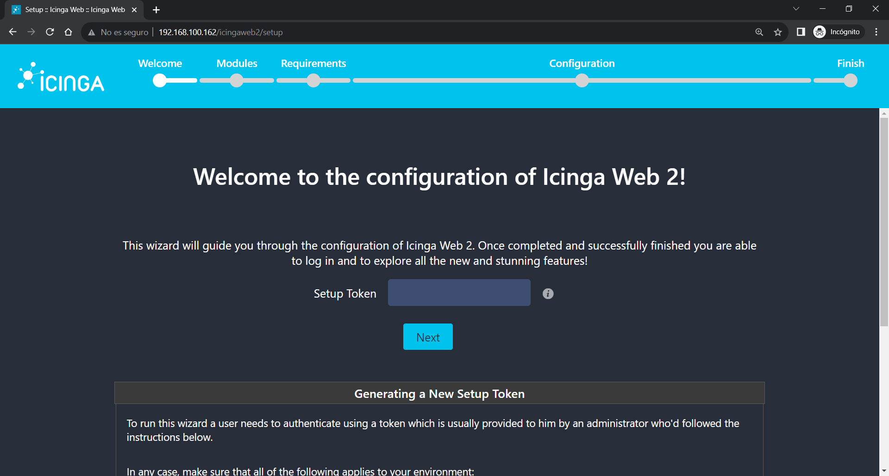

# Instalacion
```bash
sudo apt-get install ruby ruby-dev
```
Para instalar icinga debemos correr el Script repo_list.rb para agregar el repositorio de forma automatica
```bash
sudo ruby repo_list.rb
```
Luego de eso debemos ejecutar el script icinga2.rb para realizar la instalacion de icinga2, icingaweb2 y ademas icinga-director.
```bash
sudo ruby icinga2.rb
```
Configuramos luego el idioma de PHP

Después de todo esto, deberemos configurar la zona horaria adecuada para su máquina, lo que puede determinarse a partir de la página web oficial de PHP. 

Para ellos editaremos el fichero php.ini
```bash
sudo vi /etc/php/8.1/apache2/php.ini
```
Buscaremos la siguiente línea (Ponemos "/" y "date.timezone")
```bash
;date.timezone =
```
Le agregamos:  America/Argentina/Buenos_Aires

Guardaremos el fichero
```bash
:wq!
```
Y reiniciaremos el servicio de apache
```bash
sudo service apache2 restart
```
Una vez configurado todo debemos realizar la configuracion de icingaweb desde la url http://localhost/icingaweb2/setup

Creamos el token y lo usamos
```bash
sudo icingacli token create
```


Luego habilitamos el Modulo de monitoreo


En el siguiente paso hace un chequeo de las dependencias que debe usar la aplicacion, por lo cual debemos validar que este todo **EN VERDE**


En el caso de encontrar algun inconveniente, hay que subsanarlo antes de continuar.

Luego podemos elegir la Fuente de la Autenticacion, que puede ser por Base de datos, LDAP o algun otro servicio externo.


Configuracion la conexion, podemos validarla antes de darle NEXT.


Database Resource


Authenticacion Backend


Seteamos el usuario de ADMIN web


Aplicamos la configuracion por defecto


NEXT


NEXT


Configuramos los datos de la base Backend


Configuramos el Command Transport


NEXT


NEXT


FINISH


